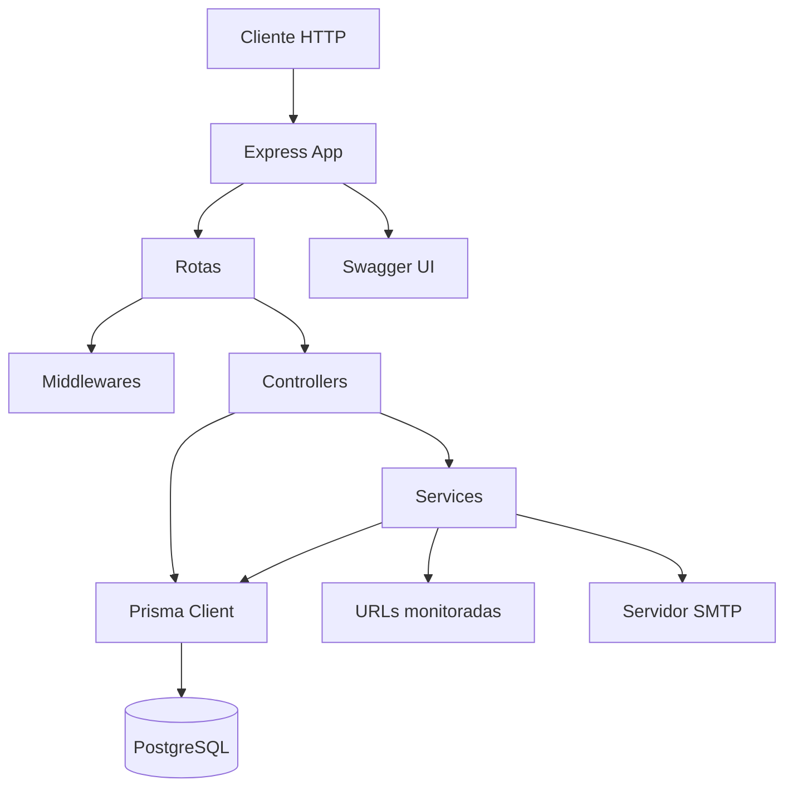
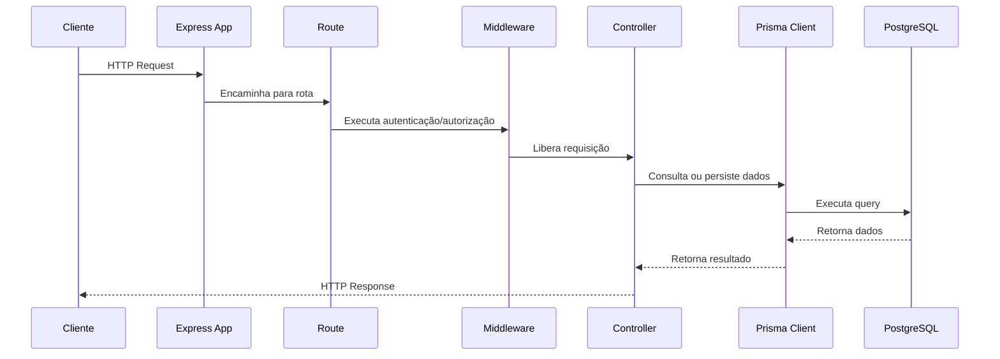
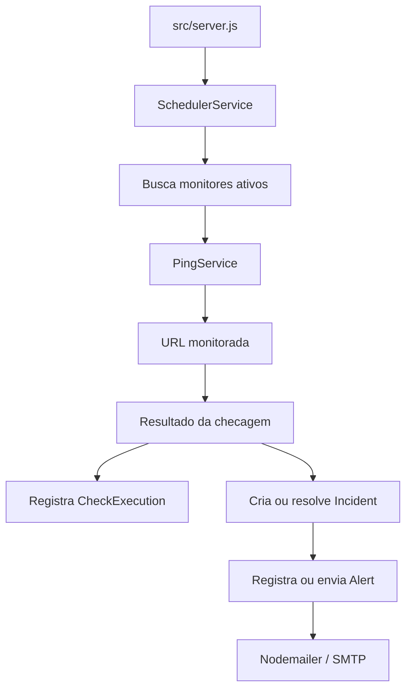
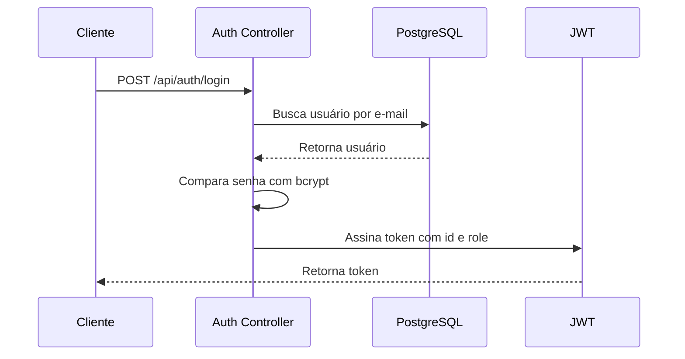
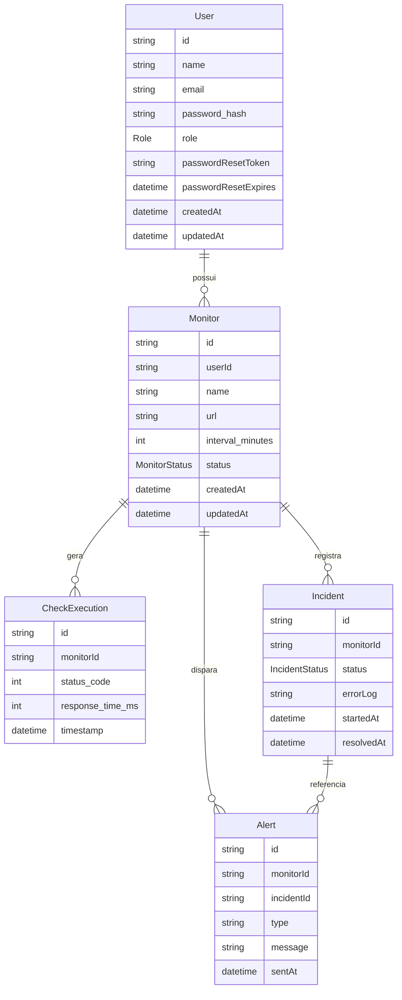

# 🏗️ **Arquitetura**

Este documento descreve a arquitetura da UptimeCore API, sua organização interna, responsabilidades das camadas, fluxo principal da aplicação e modelo de dados.

A UptimeCore API é uma aplicação backend construída com Node.js, Express, Prisma e PostgreSQL. O projeto segue uma arquitetura em camadas, com separação entre configuração da aplicação, rotas HTTP, middlewares, controllers, services e persistência.

## 🌐 **Visão Geral**

A API foi desenhada para monitorar disponibilidade de URLs e serviços HTTP. Usuários autenticados podem cadastrar monitores, e a aplicação executa verificações periódicas para registrar tempo de resposta, falhas, incidentes e alertas.



## 🧱 **Estilo Arquitetural**

O projeto utiliza uma arquitetura em camadas simples e objetiva, adequada para uma API REST.

As principais camadas são:

| Camada        | Responsabilidade                                                                    |
| ------------- | ----------------------------------------------------------------------------------- |
| `app`         | Configuração da aplicação Express, middlewares globais, rotas e tratamento de erros |
| `server`      | Inicialização do servidor HTTP e serviços em background                             |
| `routes`      | Declaração dos endpoints e associação com controllers                               |
| `middlewares` | Interceptação de requisições para autenticação, autorização e erros                 |
| `controllers` | Entrada HTTP, validações básicas, chamadas de domínio e formatação de resposta      |
| `services`    | Regras operacionais e integrações auxiliares                                        |
| `config`      | Configurações de infraestrutura, banco, e-mail e Swagger                            |
| `prisma`      | Schema, migrations e acesso ao banco de dados                                       |
| `tests`       | Testes de integração da API                                                         |

## 🔄 **Fluxo de Requisição HTTP**

O fluxo padrão de uma requisição é:



Exemplo prático:

1. O cliente envia `POST /api/monitors`.
2. A rota de monitores aplica o middleware de autenticação.
3. O middleware valida o token JWT.
4. O controller recebe `name`, `url` e `interval_minutes`.
5. O controller valida a URL.
6. O Prisma persiste o monitor no PostgreSQL.
7. A API retorna o monitor criado com status `201`.

## ⏱️ **Fluxo de Monitoramento**

Além das requisições HTTP tradicionais, a aplicação possui um fluxo em background para monitoramento.



Responsabilidades principais:

* `SchedulerService`: inicia o processo periódico de checagem.
* `PingService`: executa chamadas HTTP para as URLs monitoradas.
* `IncidentService`: gerencia abertura e resolução de incidentes.
* `AlertService`: registra e envia alertas relacionados a incidentes.

## 🔐 **Autenticação e Autorização**

A autenticação é baseada em JWT.



O token JWT inclui informações essenciais para autorização:

```json
{
  "id": "user-id",
  "role": "USER"
}
```

As rotas protegidas utilizam o middleware de autenticação para extrair e validar o token.

### **Níveis de acesso**

| Perfil  | Permissões                                                                   |
| ------- | ---------------------------------------------------------------------------- |
| `USER`  | Gerenciar o próprio perfil e seus próprios monitores                         |
| `ADMIN` | Acessar rotas administrativas e visualizar recursos com permissões ampliadas |

## 📁 **Organização dos Arquivos**

```text
src/
├── app.js
├── server.js
├── config/
│   ├── database.js
│   ├── mail.js
│   └── swagger.js
├── controllers/
│   ├── MonitorController.js
│   ├── PasswordController.js
│   ├── SessionController.js
│   └── UserController.js
├── docs/
│   └── swaggerSource.js
├── middlewares/
│   ├── auth.js
│   ├── errorMiddleware.js
│   └── isAdmin.js
├── routes/
│   ├── adminRoutes.js
│   ├── authRoutes.js
│   ├── monitorRoutes.js
│   └── userRoutes.js
├── services/
│   ├── AlertService.js
│   ├── IncidentService.js
│   ├── PingService.js
│   └── SchedulerService.js
└── utils/
    └── AppError.js
```

## 🧩 **Responsabilidades por Diretório**

### **`src/app.js`**

Responsável pela configuração principal da aplicação Express.

Inclui:

* Inicialização do Express.
* Configuração de CORS.
* Parsing de JSON.
* Remoção do header `X-Powered-By`.
* Exposição do Swagger em `/api/docs`.
* Rotas de apresentação da API.
* Health check.
* Registro dos grupos de rotas.
* Tratamento de rota não encontrada.
* Middleware global de erros.

### **`src/server.js`**

Responsável por iniciar a aplicação.

Também inicializa o motor de monitoramento por meio do `SchedulerService`.

### **`src/routes`**

Contém a definição dos grupos de rotas.

| Arquivo            | Base path       | Responsabilidade                       |
| ------------------ | --------------- | -------------------------------------- |
| `authRoutes.js`    | `/api/auth`     | Registro, login e recuperação de senha |
| `userRoutes.js`    | `/api/users`    | Operações de usuário                   |
| `monitorRoutes.js` | `/api/monitors` | Operações de monitores                 |
| `adminRoutes.js`   | `/api/admin`    | Rotas administrativas                  |

### **`src/controllers`**

Controllers recebem as requisições HTTP e coordenam as ações necessárias.

Eles são responsáveis por:

* Ler parâmetros, query strings e body.
* Aplicar validações básicas.
* Chamar Prisma ou services.
* Retornar respostas HTTP adequadas.
* Garantir que dados sensíveis não sejam expostos.

### **`src/middlewares`**

Middlewares interceptam requisições antes dos controllers.

| Middleware           | Responsabilidade                                            |
| -------------------- | ----------------------------------------------------------- |
| `auth.js`            | Validar JWT e anexar dados do usuário à requisição          |
| `isAdmin.js`         | Garantir que apenas administradores acessem rotas restritas |
| `errorMiddleware.js` | Padronizar respostas de erro                                |

### **`src/services`**

Services encapsulam operações auxiliares e lógicas que não pertencem diretamente ao ciclo HTTP.

| Service               | Responsabilidade                             |
| --------------------- | -------------------------------------------- |
| `SchedulerService.js` | Agendar e coordenar checagens periódicas     |
| `PingService.js`      | Executar chamadas HTTP para URLs monitoradas |
| `IncidentService.js`  | Gerenciar incidentes abertos e resolvidos    |
| `AlertService.js`     | Gerenciar alertas e envio de notificações    |

### **`src/config`**

Centraliza configurações de infraestrutura.

| Arquivo       | Responsabilidade                         |
| ------------- | ---------------------------------------- |
| `database.js` | Instancia e exporta o Prisma Client      |
| `mail.js`     | Configura transporte SMTP com Nodemailer |
| `swagger.js`  | Carrega a documentação Swagger gerada    |

### **`src/utils`**

Contém utilitários reutilizáveis.

Atualmente inclui:

* `AppError.js`: classe para representar erros operacionais da aplicação.

## 🗄️ **Modelo de Dados**

O banco de dados é modelado com Prisma e PostgreSQL.

Entidades principais:

* `User`
* `Monitor`
* `CheckExecution`
* `Incident`
* `Alert`



## 🧑‍💻 **Entidades**

### **User**

Representa um usuário da aplicação.

Campos principais:

| Campo                  | Descrição                         |
| ---------------------- | --------------------------------- |
| `id`                   | Identificador único               |
| `name`                 | Nome do usuário                   |
| `email`                | E-mail único                      |
| `password_hash`        | Hash da senha                     |
| `role`                 | Perfil do usuário                 |
| `passwordResetToken`   | Token temporário de recuperação   |
| `passwordResetExpires` | Expiração do token de recuperação |

Relacionamentos:

* Um usuário pode possuir vários monitores.

### **Monitor**

Representa uma URL monitorada.

Campos principais:

| Campo              | Descrição                 |
| ------------------ | ------------------------- |
| `id`               | Identificador único       |
| `userId`           | Dono do monitor           |
| `name`             | Nome descritivo           |
| `url`              | URL monitorada            |
| `interval_minutes` | Intervalo entre checagens |
| `status`           | Estado do monitor         |

Relacionamentos:

* Pertence a um usuário.
* Possui várias execuções de checagem.
* Pode possuir vários incidentes.
* Pode gerar vários alertas.

### **CheckExecution**

Representa uma execução de checagem.

Campos principais:

| Campo              | Descrição                          |
| ------------------ | ---------------------------------- |
| `id`               | Identificador único                |
| `monitorId`        | Monitor relacionado                |
| `status_code`      | Código HTTP retornado              |
| `response_time_ms` | Tempo de resposta em milissegundos |
| `timestamp`        | Momento da checagem                |

Observação:

* Existe índice em `monitorId` e `timestamp` para otimizar consultas históricas por monitor.

### **Incident**

Representa uma falha detectada em um monitor.

Campos principais:

| Campo        | Descrição              |
| ------------ | ---------------------- |
| `id`         | Identificador único    |
| `monitorId`  | Monitor relacionado    |
| `status`     | Estado do incidente    |
| `errorLog`   | Detalhes da falha      |
| `startedAt`  | Início do incidente    |
| `resolvedAt` | Resolução do incidente |

### **Alert**

Representa uma notificação associada a um monitor ou incidente.

Campos principais:

| Campo        | Descrição                             |
| ------------ | ------------------------------------- |
| `id`         | Identificador único                   |
| `monitorId`  | Monitor relacionado                   |
| `incidentId` | Incidente relacionado, quando existir |
| `type`       | Tipo do alerta                        |
| `message`    | Mensagem enviada                      |
| `sentAt`     | Data de envio                         |

## 📚 **Enums**

### **Role**

```text
USER
ADMIN
```

### **MonitorStatus**

```text
ACTIVE
PAUSED
```

### **IncidentStatus**

```text
OPEN
RESOLVED
```

## 🏛️ **Decisões Arquiteturais**

### **Separação entre `app.js` e `server.js`**

A aplicação Express fica isolada em `app.js`, enquanto a inicialização do servidor fica em `server.js`.

Isso facilita:

* Testes de integração sem abrir porta HTTP manualmente.
* Reuso do app em Supertest.
* Inicialização controlada de serviços em background.
* Separação entre configuração da aplicação e execução do processo.

### **Swagger gerado antes do runtime**

A documentação Swagger é gerada por script e carregada no runtime.

Benefícios:

* Evita geração dinâmica a cada inicialização.
* Reduz complexidade em produção.
* Garante que o build já contenha a documentação necessária.

### **Prisma como camada de persistência**

O Prisma centraliza:

* Modelagem do banco.
* Migrations.
* Tipagem e estrutura das consultas.
* Acesso padronizado ao PostgreSQL.

### **Services para tarefas operacionais**

A lógica de monitoramento, ping, incidentes e alertas fica em `services`, separada dos controllers.

Isso evita que controllers fiquem responsáveis por tarefas de background ou integração externa.

## 🚀 **Pontos de Extensão**

A arquitetura atual permite evoluções como:

* Adição de refresh token.
* Rate limiting.
* Logs estruturados.
* Métricas com Prometheus.
* Filas para checagens assíncronas.
* Notificações por webhook, Slack ou Discord.
* Dashboard com histórico de uptime.
* Multi-tenancy.
* Separação entre worker de monitoramento e API HTTP.

## 📝 **Considerações**

A arquitetura atual é adequada para um MVP backend robusto, com boa separação de responsabilidades e base preparada para evolução.

Para cargas maiores, o principal ponto de evolução seria separar o processo de monitoramento em um worker independente, usando fila ou scheduler externo. Isso permitiria escalar a API HTTP e o motor de checagens de forma separada.