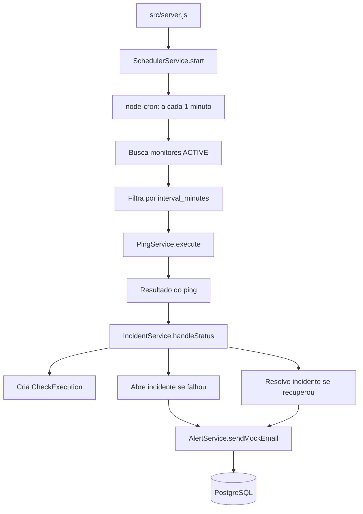
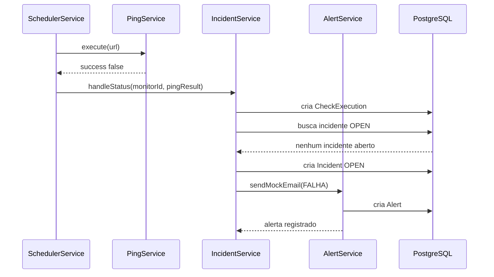
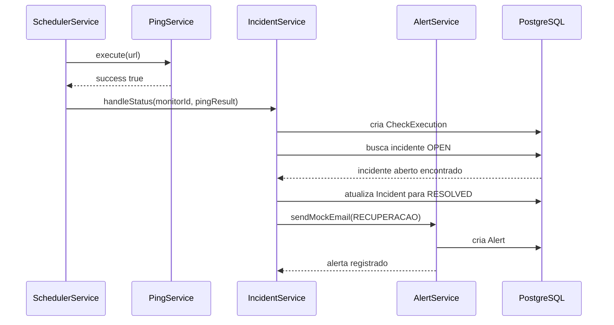

# ⚙️ Services

Este documento explica o funcionamento dos **services** da UptimeCore API, que são responsáveis pela lógica operacional de monitoramento, execução de pings, gerenciamento de incidentes e registro de alertas.

Enquanto os **controllers** cuidam do ciclo HTTP, os **services** concentram o comportamento interno que faz a aplicação monitorar URLs de forma automática.

## 📚 Sumário

- [Visão Geral](#-visão-geral)
- [Responsabilidade dos Services](#-responsabilidade-dos-services)
- [Fluxo Geral de Monitoramento](#-fluxo-geral-de-monitoramento)
- [SchedulerService](#-schedulerservice)
- [PingService](#-pingservice)
- [IncidentService](#-incidentservice)
- [AlertService](#-alertservice)
- [Fluxo de Falha](#-fluxo-de-falha)
- [Fluxo de Recuperação](#-fluxo-de-recuperação)
- [Como Visualizar o Funcionamento](#-como-visualizar-o-funcionamento)
- [Logs Esperados](#-logs-esperados)
- [Decisões Técnicas](#-decisões-técnicas)
- [Pontos de Evolução](#-pontos-de-evolução)

## 🧭 Visão Geral

Os services representam o coração operacional da UptimeCore API.

Eles são responsáveis por:

- Buscar monitores ativos.
- Decidir quais monitores devem ser executados em cada minuto.
- Fazer requisições HTTP para as URLs monitoradas.
- Medir tempo de resposta.
- Registrar cada execução no banco.
- Abrir incidentes quando uma URL falha.
- Resolver incidentes quando uma URL volta a responder.
- Registrar alertas de falha e recuperação.

Os arquivos ficam em:

```text
src/services/
├── AlertService.js
├── IncidentService.js
├── PingService.js
└── SchedulerService.js
```

## 🧩 Responsabilidade dos Services

| Service | Responsabilidade |
|---|---|
| `SchedulerService` | Agenda e coordena as execuções periódicas dos monitores |
| `PingService` | Executa a requisição HTTP para uma URL e mede o resultado |
| `IncidentService` | Registra execuções, abre incidentes e resolve incidentes existentes |
| `AlertService` | Registra alertas no banco e simula envio de e-mail |

## 🔄 Fluxo Geral de Monitoramento

O fluxo começa automaticamente quando o servidor sobe.



## ⏰ SchedulerService

Arquivo:

```text
src/services/SchedulerService.js
```

O `SchedulerService` é responsável por iniciar o agendador de monitoramento.

Ele usa a biblioteca **node-cron** para executar uma rotina a cada minuto:

```js
cron.schedule('* * * * *', async () => {
  // ciclo de monitoramento
});
```

### O que ele faz

1. Obtém o minuto atual.
2. Busca todos os monitores com status `ACTIVE`.
3. Filtra quais monitores devem rodar naquele minuto.
4. Executa o ping para cada monitor selecionado.
5. Envia o resultado para o `IncidentService`.
6. Isola erros por monitor para uma falha não interromper o ciclo inteiro.

### Regra de intervalo

Cada monitor possui o campo:

```text
interval_minutes
```

O scheduler decide se um monitor deve rodar usando:

```js
currentMinute % monitor.interval_minutes === 0
```

Exemplo:

| `interval_minutes` | Minutos em que executa |
|---|---|
| `1` | Todos os minutos |
| `5` | 0, 5, 10, 15, 20... |
| `10` | 0, 10, 20, 30, 40... |
| `15` | 0, 15, 30, 45 |

### Decisão importante

Os pings são executados de forma **sequencial**.

Isso é uma escolha segura para o MVP, pois evita sobrecarregar o event loop ou disparar muitas requisições ao mesmo tempo.

Em uma escala maior, essa responsabilidade poderia migrar para uma fila com Redis, BullMQ, RabbitMQ ou outro mecanismo de processamento assíncrono.

## 📡 PingService

Arquivo:

```text
src/services/PingService.js
```

O `PingService` executa a checagem HTTP de uma URL.

Ele usa **Axios** para fazer uma requisição `GET` com timeout de 10 segundos.

```js
const response = await axios.get(url, {
  timeout: 10000,
});
```

### Entrada

```js
await PingService.execute(url);
```

Exemplo:

```js
await PingService.execute('https://uptime-core-api.onrender.com/api/health');
```

### Saída em caso de sucesso

```json
{
  "success": true,
  "statusCode": 200,
  "responseTimeMs": 142,
  "errorLog": null
}
```

### Saída em caso de falha HTTP

```json
{
  "success": false,
  "statusCode": 500,
  "responseTimeMs": 215,
  "errorLog": "HTTP Error 500"
}
```

### Saída em caso de timeout

```json
{
  "success": false,
  "statusCode": null,
  "responseTimeMs": 10001,
  "errorLog": "Timeout (10000ms)"
}
```

### Tipos de falha tratados

| Caso | Resultado |
|---|---|
| Servidor responde com erro HTTP | `HTTP Error statusCode` |
| Timeout | `Timeout (10000ms)` |
| Requisição enviada sem resposta | `No response from server` |
| Erro inesperado | Mensagem original do erro |

### Por que usar GET?

O serviço utiliza `GET` porque alguns servidores bloqueiam ou tratam mal requisições `HEAD`.

Essa escolha aumenta a compatibilidade com endpoints comuns, embora possa ser otimizada futuramente com limite de download, streaming ou fallback entre `HEAD` e `GET`.

## 🚨 IncidentService

Arquivo:

```text
src/services/IncidentService.js
```

O `IncidentService` é responsável por interpretar o resultado do ping.

Ele recebe:

```js
await IncidentService.handleStatus(monitorId, pingResult);
```

### Responsabilidades

- Criar um registro em `CheckExecution` para cada checagem.
- Verificar se já existe incidente aberto para o monitor.
- Abrir um novo incidente quando o monitor falha.
- Manter o incidente aberto caso a falha continue.
- Resolver o incidente quando o monitor volta a responder.
- Acionar alertas em transições de estado.

## 🧾 Registro de CheckExecution

Toda execução de monitoramento gera um registro em:

```text
check_executions
```

Dados persistidos:

```js
{
  monitorId,
  status_code: pingResult.statusCode,
  response_time_ms: pingResult.responseTimeMs
}
```

Isso permite manter histórico de:

- Disponibilidade.
- Tempo de resposta.
- Status HTTP.
- Evolução operacional por monitor.

## 🔥 Abertura de Incidente

Quando `pingResult.success` é `false`, o service verifica se já existe um incidente `OPEN`.

### Se não existir incidente aberto

Ele cria um novo incidente:

```js
const newIncident = await prisma.incident.create({
  data: {
    monitorId,
    status: 'OPEN',
    errorLog: pingResult.errorLog,
  },
});
```

Depois aciona o alerta de falha:

```js
await AlertService.sendMockEmail(
  monitorId,
  newIncident.id,
  'FALHA',
  pingResult.errorLog
);
```

### Se já existir incidente aberto

O service não cria outro incidente.

Ele apenas mantém o incidente atual aberto e retorna:

```json
{
  "stateChanged": false,
  "incident": "openIncident"
}
```

Essa decisão evita gerar múltiplos incidentes repetidos para a mesma falha contínua.

## ✅ Resolução de Incidente

Quando `pingResult.success` é `true`, o service verifica se existe incidente aberto.

### Se existir incidente aberto

Ele atualiza o incidente para `RESOLVED`:

```js
const resolvedIncident = await prisma.incident.update({
  where: { id: openIncident.id },
  data: {
    status: 'RESOLVED',
    resolvedAt: new Date(),
  },
});
```

Depois aciona alerta de recuperação:

```js
await AlertService.sendMockEmail(
  monitorId,
  resolvedIncident.id,
  'RECUPERACAO',
  null
);
```

### Se não existir incidente aberto

A URL segue saudável e nenhum incidente é alterado.

## 📬 AlertService

Arquivo:

```text
src/services/AlertService.js
```

O `AlertService` registra alertas no banco e simula o envio de e-mail no terminal.

Atualmente, o método principal é:

```js
await AlertService.sendMockEmail(monitorId, incidentId, status, reason);
```

### Parâmetros

| Parâmetro | Descrição |
|---|---|
| `monitorId` | ID do monitor associado |
| `incidentId` | ID do incidente relacionado |
| `status` | Tipo da transição: `FALHA` ou `RECUPERACAO` |
| `reason` | Motivo da falha, quando existir |

### O que ele faz

1. Busca o monitor pelo ID.
2. Inclui dados do usuário dono do monitor.
3. Monta assunto e mensagem.
4. Persiste o alerta no banco.
5. Simula o envio no terminal com `console.log`.

### Alerta de falha

Quando o status é `FALHA`, o assunto segue o formato:

```text
[ALERTA CRÍTICO] O monitor "Nome do Monitor" caiu
```

A mensagem inclui:

- Nome do usuário.
- URL monitorada.
- Motivo da falha.

### Alerta de recuperação

Quando o status é `RECUPERACAO`, o assunto segue o formato:

```text
[RECUPERAÇÃO] O monitor "Nome do Monitor" voltou a operar
```

A mensagem informa que o serviço voltou a responder.

### Persistência do alerta

Todo alerta é salvo na tabela:

```text
alerts
```

Com:

```js
{
  monitorId,
  incidentId,
  type: 'EMAIL',
  message: `${subject} - ${message}`
}
```

## 🔥 Fluxo de Falha

Quando uma URL monitorada deixa de responder corretamente:



Resultado:

- Uma execução é registrada.
- Um incidente `OPEN` é criado.
- Um alerta de falha é salvo.
- Um mock de e-mail aparece no terminal.

## ✅ Fluxo de Recuperação

Quando uma URL volta a responder após uma falha:



Resultado:

- Uma nova execução é registrada.
- O incidente aberto é marcado como `RESOLVED`.
- O campo `resolvedAt` é preenchido.
- Um alerta de recuperação é salvo.
- Um mock de e-mail aparece no terminal.

## 👀 Como Visualizar o Funcionamento

Existem algumas formas práticas de observar os services em ação.

## 🖥️ 1. Visualizar pelo Terminal

Inicie a API:

```bash
npm run dev
```

Quando o servidor subir, você deve ver um log semelhante a:

```text
UptimeCore API rodando em http://localhost:3000
Scheduler de Monitoramento iniciado.
```

Quando houver monitores ativos no minuto correto, o scheduler exibirá algo como:

```text
[CRON] Executando ping para 1 monitor(es)...
```

Se uma URL falhar:

```text
[ALERTA] Monitor monitor-id CAIU. Motivo: Timeout (10000ms)
```

Se uma URL voltar ao ar:

```text
[RECUPERAÇÃO] Monitor monitor-id VOLTOU a ficar online.
```

Quando um alerta for gerado:

```text
======================================================
[MOCK EMAIL DISPARADO]
Para: usuario@example.com
Assunto: [ALERTA CRÍTICO] O monitor "Minha API" caiu
Mensagem: Olá, João. Detectamos que o serviço associado à URL (...) parou de responder.
Status do Banco: Alerta salvo (ID: alert-id)
======================================================
```

## 🧪 2. Visualizar Criando um Monitor de Teste

Crie um monitor com intervalo de 1 minuto para facilitar a visualização.

```bash
curl -X POST http://localhost:3000/api/monitors \
  -H "Content-Type: application/json" \
  -H "Authorization: Bearer jwt-token" \
  -d '{
    "name": "Teste Local",
    "url": "https://uptime-core-api.onrender.com/api/health",
    "interval_minutes": 1
  }'
```

Com `interval_minutes: 1`, o scheduler avaliará esse monitor em todo ciclo de cron.

## 🧨 3. Simular Falha

Crie um monitor apontando para uma URL inválida ou indisponível:

```bash
curl -X POST http://localhost:3000/api/monitors \
  -H "Content-Type: application/json" \
  -H "Authorization: Bearer jwt-token" \
  -d '{
    "name": "URL Indisponível",
    "url": "https://servico-inexistente-exemplo-123.com",
    "interval_minutes": 1
  }'
```

Depois aguarde o próximo ciclo do scheduler.

Resultado esperado:

- Registro em `check_executions`.
- Criação de incidente com status `OPEN`.
- Criação de alerta com type `EMAIL`.
- Log de mock e-mail no terminal.

## 🛠️ 4. Visualizar pelo Banco de Dados

Você pode consultar diretamente as tabelas no PostgreSQL.

### Ver execuções

```sql
SELECT *
FROM check_executions
ORDER BY timestamp DESC;
```

### Ver incidentes

```sql
SELECT *
FROM incidents
ORDER BY "startedAt" DESC;
```

### Ver alertas

```sql
SELECT *
FROM alerts
ORDER BY "sentAt" DESC;
```

### Ver monitores ativos

```sql
SELECT *
FROM monitors
WHERE status = 'ACTIVE';
```

## 📖 5. Visualizar pela API

Liste os monitores do usuário autenticado:

```bash
curl http://localhost:3000/api/monitors \
  -H "Authorization: Bearer jwt-token"
```

Busque um monitor específico:

```bash
curl http://localhost:3000/api/monitors/monitor-id \
  -H "Authorization: Bearer jwt-token"
```

Atualmente, os registros de `CheckExecution`, `Incident` e `Alert` são persistidos no banco, mas não possuem endpoints públicos dedicados para consulta detalhada.

## 📋 Logs Esperados

### Inicialização

```text
UptimeCore API rodando em http://localhost:3000
Scheduler de Monitoramento iniciado.
```

### Execução de cron

```text
[CRON] Executando ping para 2 monitor(es)...
```

### Falha detectada

```text
[ALERTA] Monitor monitor-id CAIU. Motivo: HTTP Error 500
```

### Recuperação detectada

```text
[RECUPERAÇÃO] Monitor monitor-id VOLTOU a ficar online.
```

### Falha isolada em um monitor

```text
Falha isolada ao processar monitor monitor-id:
```

### Erro crítico no ciclo

```text
Erro crítico no ciclo do Scheduler:
```

## 🧠 Decisões Técnicas

### Execução a cada minuto

O cron roda a cada minuto e usa `interval_minutes` para decidir se um monitor deve executar naquele ciclo.

Essa abordagem é simples, previsível e suficiente para o MVP.

### Pings sequenciais

Os monitores são processados um por vez.

Isso reduz risco de sobrecarga e torna o comportamento mais previsível.

### Incidentes não são duplicados

Enquanto um incidente está `OPEN`, novas falhas do mesmo monitor não criam incidentes adicionais.

Isso evita poluir o banco com incidentes repetidos para o mesmo evento.

### Alertas só ocorrem em transição de estado

O sistema gera alerta quando:

- O monitor muda de saudável para falho.
- O monitor muda de falho para saudável.

Ele não dispara alerta a cada nova falha enquanto o incidente já está aberto.

### Mock de e-mail

O `AlertService` atualmente simula o envio de e-mail no terminal e salva o alerta no banco.

Isso permite validar o fluxo completo sem depender de um provedor SMTP real para os alertas de monitoramento.

## 🚧 Pontos de Evolução

Melhorias futuras recomendadas:

- [ ] Separar scheduler em um worker independente.
- [ ] Processar pings em paralelo com limite de concorrência.
- [ ] Usar fila com BullMQ, Redis ou RabbitMQ.
- [ ] Adicionar endpoints para consultar histórico de execuções.
- [ ] Adicionar endpoints para consultar incidentes por monitor.
- [ ] Adicionar endpoints para consultar alertas.
- [ ] Enviar e-mails reais no `AlertService`.
- [ ] Adicionar retry antes de abrir incidente.
- [ ] Adicionar política de confirmação de falha.
- [ ] Adicionar monitoramento por região.
- [ ] Adicionar métricas agregadas de uptime.
- [ ] Adicionar cálculo de disponibilidade por período.
- [ ] Adicionar logs estruturados.
- [ ] Adicionar tracing por ciclo de monitoramento.
- [ ] Adicionar dashboard operacional.